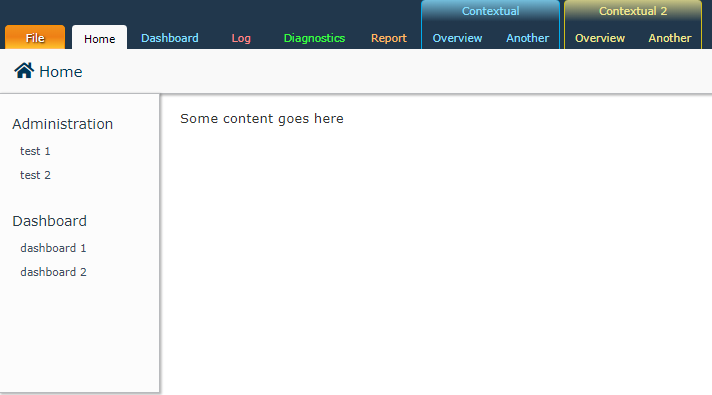

# A re-creation of the Office 2010 ribbon in react

After git-cloning, and installing dependencies, run `yarn start run` or `npm start run`.

Includes a functioning ribbon toolbar (with tabbed ribbon buttons and grouped contextual ribbons, also with 5 different colours).

It was built with IE11 compatibility in mind, so should work with all other major browsers without issue.

## Things missing

This implementation only includes tab and styling for tabs and tab groups; it doesn't yet include an implementation for buttons and button groups, but doing that should be easy enough.

## Screenshot:

# Misc

This project was bootstrapped with [Create React App](https://github.com/facebookincubator/create-react-app).

Below you will find some information on how to perform common tasks. 
You can find the most recent version of this guide [here](https://github.com/facebookincubator/create-react-app/blob/master/packages/react-scripts/template/README.md).

